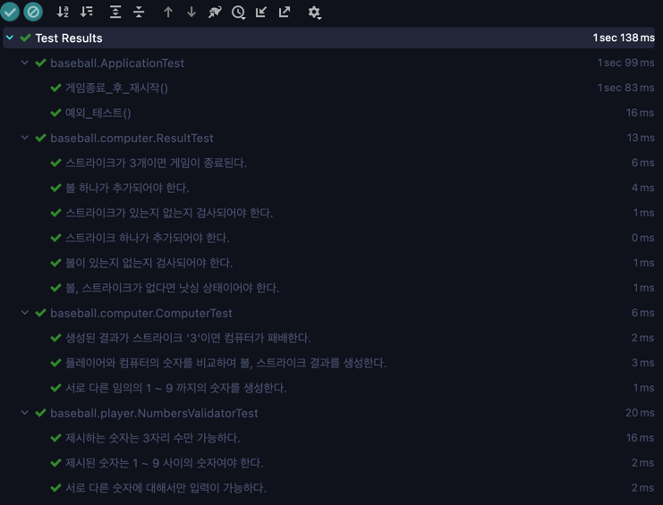

### 기능구현목록
+ 컴퓨터는 게임이 시작될 때 서로 다른 임의의 숫자 3자리를 보관한다.
+ 플레이어는 숫자 3자리를 제시한다. (단, 숫자가 아닌 것을 제시하거나 중복되는 숫자를 제시하면 IllegalArgumentException 이 발생된다)
+ 게임은 플레이어의 숫자와 컴퓨터의 숫자에 대한 볼, 스트라이크, 낫싱의 결과를 준다.
+ 결과가 3 스트라이크일 경우 게임이 종료된다.
+ 플레이어는 게임이 종료된 후 새로 시작할지 말지 결정한다.

### 테스트 실행결과
